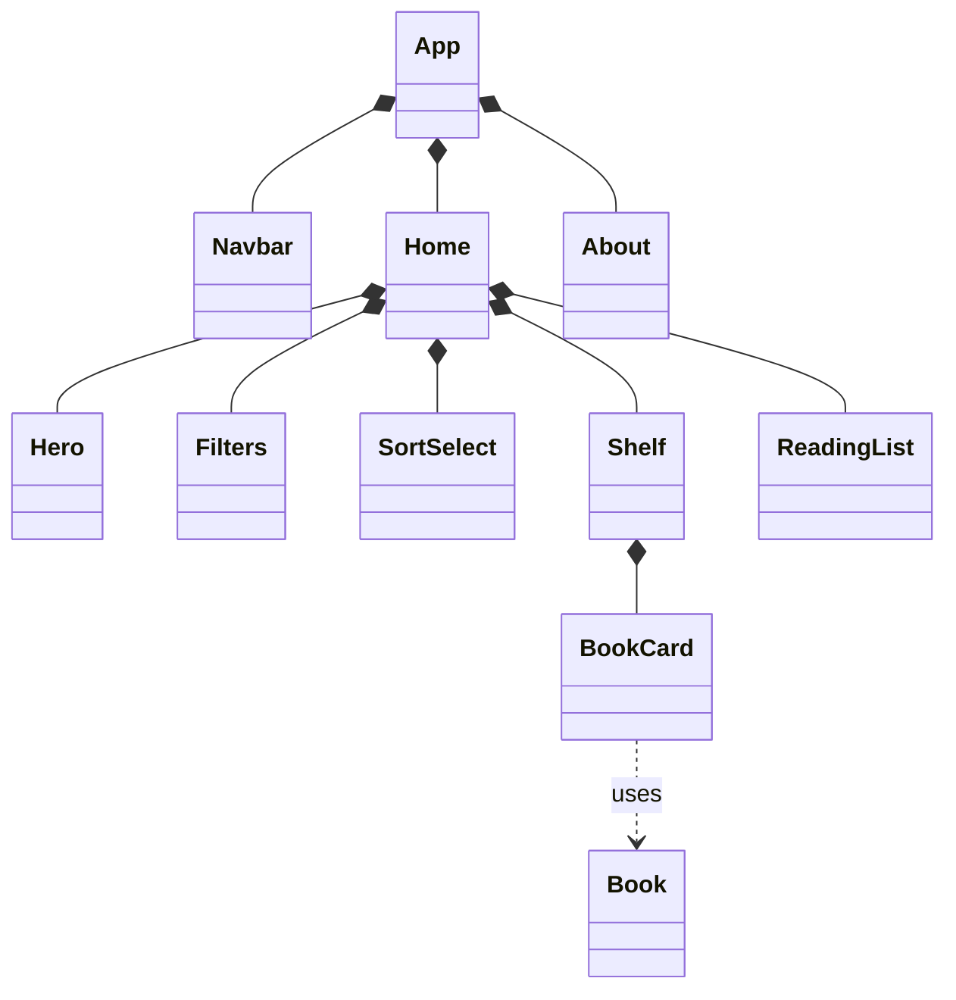
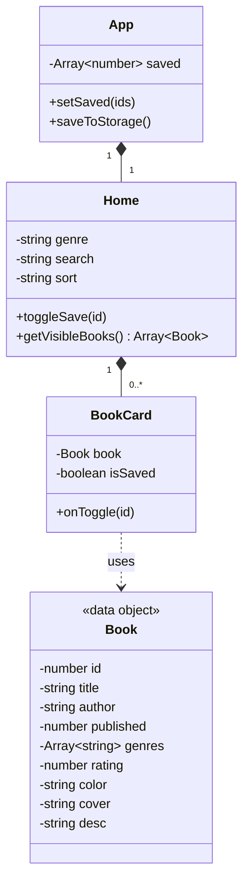

# React + Vite
# Cozy Shelf

A small book website built with React, Vite, Tailwind CSS, and React Router.

## Features

- Search books by title or author
- Filter by genre (a book can have several genres)
- Sort by title, year, or rating
- Save books to a reading list that is remembered after a refresh
- About page

## Class diagrams

### Component structure

### Class details

